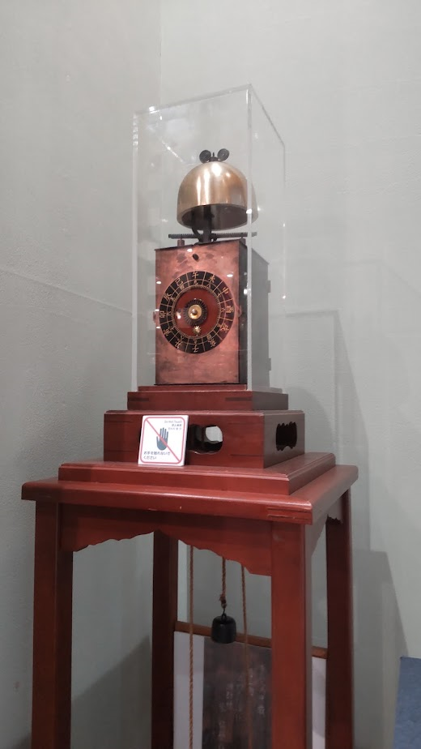
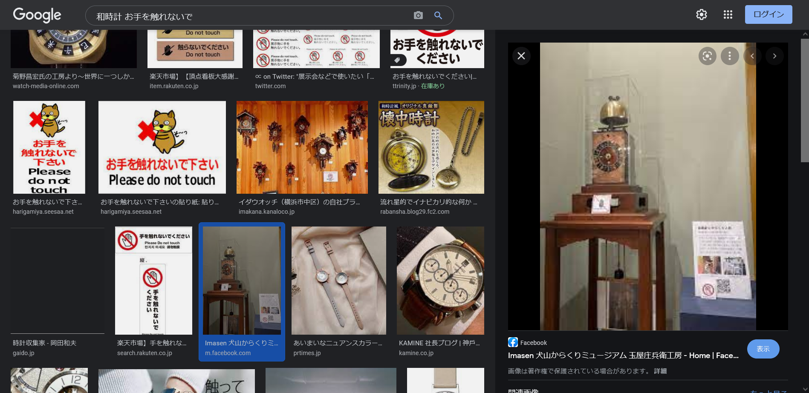
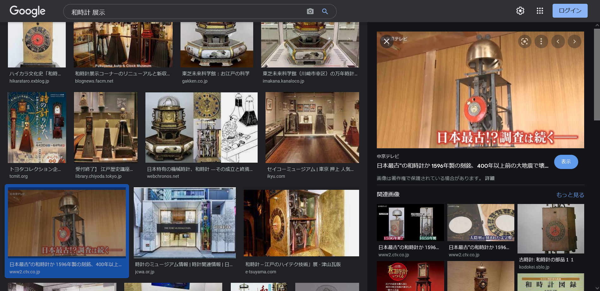

# zerosolve🕛

## 問題文
難しいと怒られましたが、解けませんか？  
この時計が**現在**展示されている建物の電話番号を特定してください。  
フラグ形式:  
`imctf{XXXX-XX-XXXX}`  
[DSC_0000.png](files/DSC_0000.png)  

## 難易度
**medium**  

## 作問にあたって
作問時に友人に難しすぎると怒られた問題です。  
Googleさんはなんでも知っていますね(画像の中の文字まで...)。  

## 解法
時計の写真が配布される。  
  
画像検索やGoogleレンズを利用しても似た画像が多すぎる。  
文字盤が干支なので、「干支　時計　展示」などでGoogle検索するとこの形式の時計が和時計ということがわかる。  
ここからの解法は複数ある。  
**解法1**  
画像を拡大すると、警告文が読み取れる。  
Googleで「和時計　お手を触れないで」で画像検索すると同じ時計の写真が出る。  
  
そのページに電話番号を見つけることができる。  
`Imasen 犬山からくりミュージアム 玉屋庄兵衛工房`であり、電話番号は`0568-61-3932`であるらしい。  
指定された形式に整形するとflagとなる。  
  
**解法2**  
Googleで「和時計　展示」を画像検索すると`日本最古”の和時計か 1596年製の刻銘、400年以上前の大地震で壊...`という記事が出る。  
  
この画像を見ると、時計上部のデザイン、針の形が一致する。  
記事内から以前まで犬山市の`昭和レトロ館`にあったことがわかるが、閉館している。  
犬山ということが分かったので、「犬山 和時計 展示」で画像検索すると**解法1**と同じ時計の写真が出る。  
あとは**解法1**と同様となる。  

**解法3**  
時計部分を切り取りGoogle画像検索でファイル検索し、検索文字列を「和時計」に変更すると**解法1**と同じ時計の写真が出る。  
あとは**解法1**と同様となる。  

## imctf{0568-61-3932}
