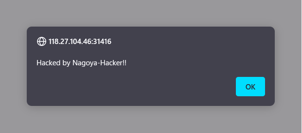
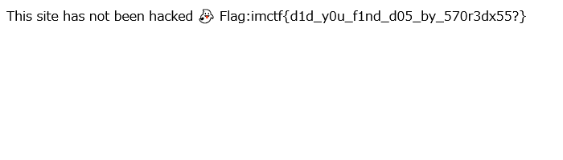

# DoScript🐣

## 問題文
安全なサイトを作ったのにハッキングされて、alertが出るようになってしまいました。幸いなことにalert以外の被害はないようです。改竄チェッカーをごまかせませんかね？  
[http://118.27.104.46:31416/](http://118.27.104.46:31416/)  
[app.py](files/app.py)  

## 難易度
**easy**  

## 作問にあたって
約20,000社で利用されているらしいサービスの、実際の脆弱性として報告したものです。  
謎のサニタイズによってXSSが発火しないようになっていましたが、蓄積型のDoSを行えました。  
この問題では扱っていませんが、しっかりサニタイズされていない場合は改行コードなどにも要注意です。  

## 解法
サイトにアクセスすると、何やらアラートが出現する。  
  
ハッキングされて改竄されてしまったようだ。  
`/tamperchecker`ではサイトの改竄をチェックできるようだ。  
問題文より、alertを出なくすればよいようだが、サイトソースを見ると以下のようになっていて難しい。  
```html
~~~
<ScRiPt>
//Hack! Hack! Hack!
alert("Hacked by Nagoya-Hacker!!");
alert("Is there any way to turn off the alerts?");
alert("Hehehehehe");
</ScRiPt>
~~~
```
配布されたapp.pyを見ると以下のようでった。  
```python
~~~
def js_sanitize(text):
    #I've heard that this is enough to sanitize special characters in JavaScript.
    return "".join([c for c in text if ord(c) > 0x1f]).replace("\\", "\\\\").replace("\"", "\\\"").replace("'", "\\'").replace("/", "\\/")

@app.route("/")
def doscript():
    name = request.args.get("name")
    if not name:
        name = 'Nagoya-Hacker'
    html = f"""<!DOCTYPE html>
<html lang="ja">
<head>
<title>DoScript</title>
<ScRiPt>
//Hack! Hack! Hack!
alert("Hacked by {js_sanitize(name)}!!");
alert("Is there any way to turn off the alerts?");
alert("Hehehehehe");
</ScRiPt>
~~~
```
`name`で名前を指定できるが、`\`、`"`、`'`、`/`がサニタイズされているようだ。  
XSSするのは難しいがDoSを起こせばよい。  
app.pyでは以下のようにalertが発生しない場合、flagが手に入るとされている。  
```python
~~~
        url = request.form["url"]
        if f"{mysite}?name=" != url[0:len(mysite + "?name=")]:
            return "Not my site!"
        if len(url) > 100:
            return "URL is too long!"
        url = f"{mysite}?name=" + urllib.parse.quote(url.replace(f"{mysite}?name=", ""))
        try:
            cmd = f'chromium-browser --no-sandbox --headless --disable-gpu "{url}"'
            subprocess.run(cmd, shell=True, timeout=3)
        except:
            return 'This site has been hacked 👾'#Alerts are detected.
        return f'This site has not been hacked 👻\nFlag:{os.getenv("FLAG")}'#No alerts are detected.
~~~
```
「JSでDoS」など調べると、[JSでDoSる/ Shibuya.XSS techtalk #11](https://speakerdeck.com/masatokinugawa/shibuya-dot-xss-techtalk-number-11)を見つけられる。  
どうやら文字列リテラル中で`<!--<script>`を利用するとJSが壊れる仕様があるようだ。  
JSが壊れるとalertは発火しない。  
`http://118.27.104.46:31416/?name=<!--<script>`を`/tamperchecker`で送信してやればよい。  
  
flagが得られた。  

## imctf{d1d_y0u_f1nd_d05_by_570r3dx55?}
