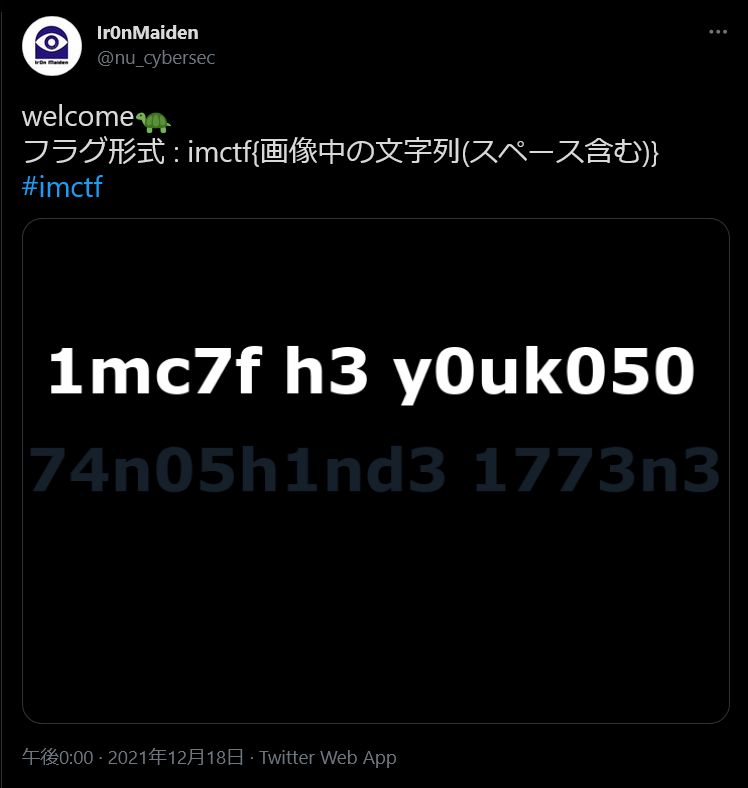
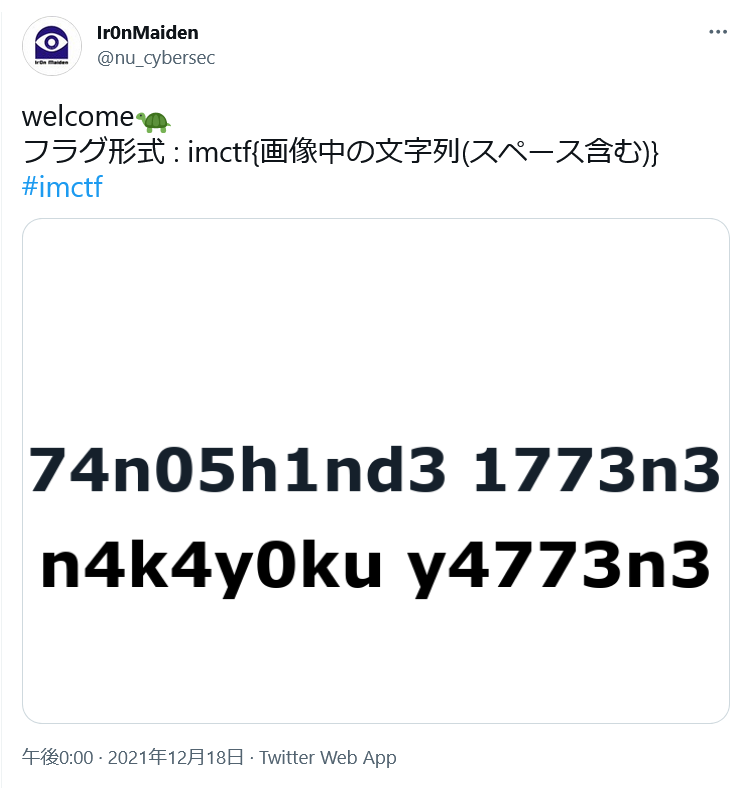
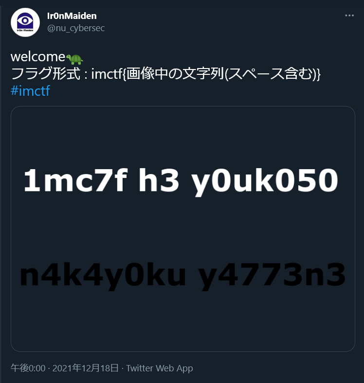

# welcome🐢

## 問題文
Ir0nMaidenの[公式twitterアカウント](https://twitter.com/nu_cybersec)からwelcome問を探し出してください！  

## 難易度
  

## 作問にあたって
深夜に作ったwelcome問題です。  
Twitterのブラックモードで、画像の背景が透過されている場合に黒文字が見えなくなる現象からヒントを得ました。  
きれいに消そうかとも思ったのですが、welcomeなので全員が解けるように少し違和感が残るようにしました。  

## 解法
指定されたとおりにTwitterを見ると以下のツイートが目に入る。  
  
flagが`imctf{1mc7f h3 y0uk050 74n05h1nd3 1773n3}`かと思うが、Twitterのモードを変えると以下のようになる。  
デフォルト  
  
ダークブルー  
  
各モードによって見えない文字が隠れている。  
塗りつぶしなどで見えない文字を見えるようにし、指定された形式に整形するとflagとなる。  

## imctf{1mc7f h3 y0uk050 74n05h1nd3 1773n3 n4k4y0ku y4773n3}
